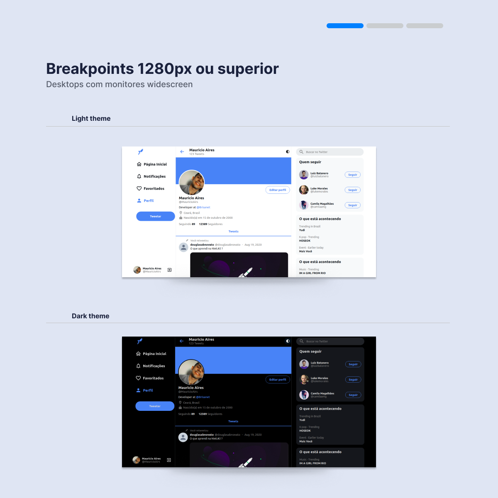
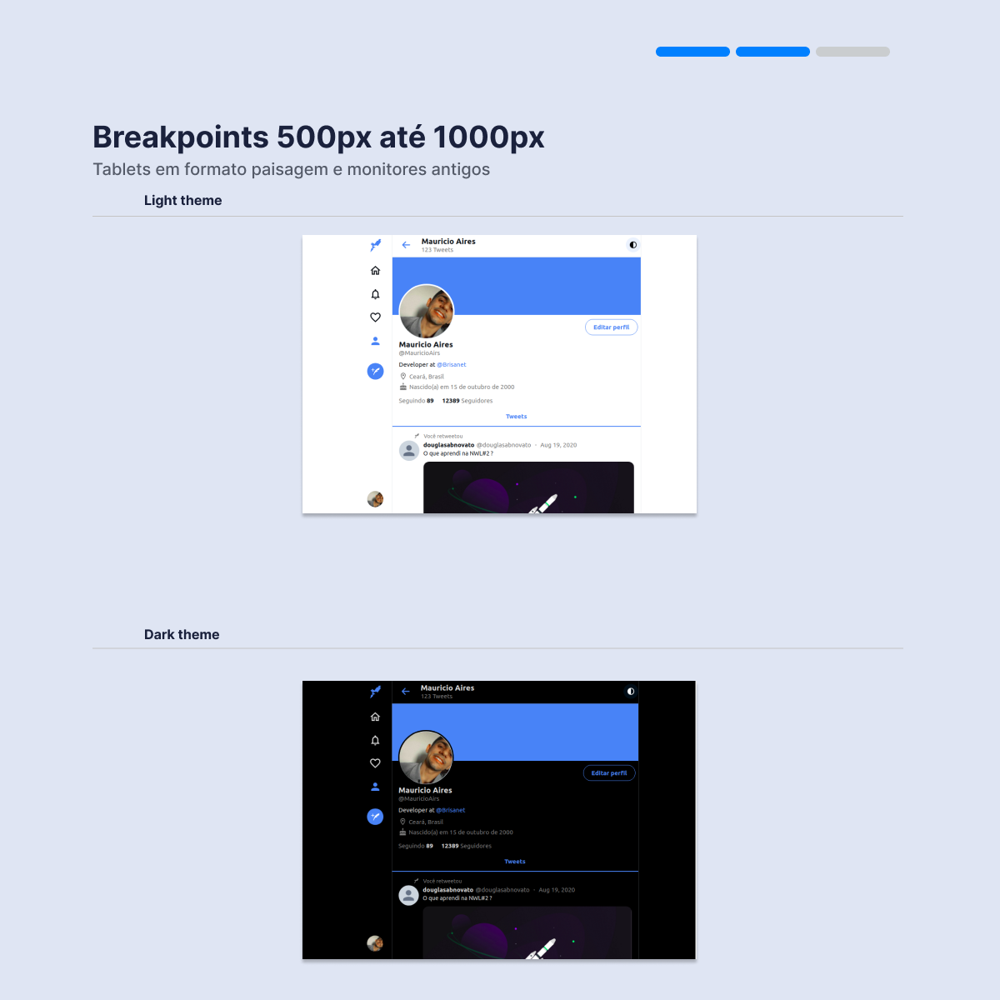
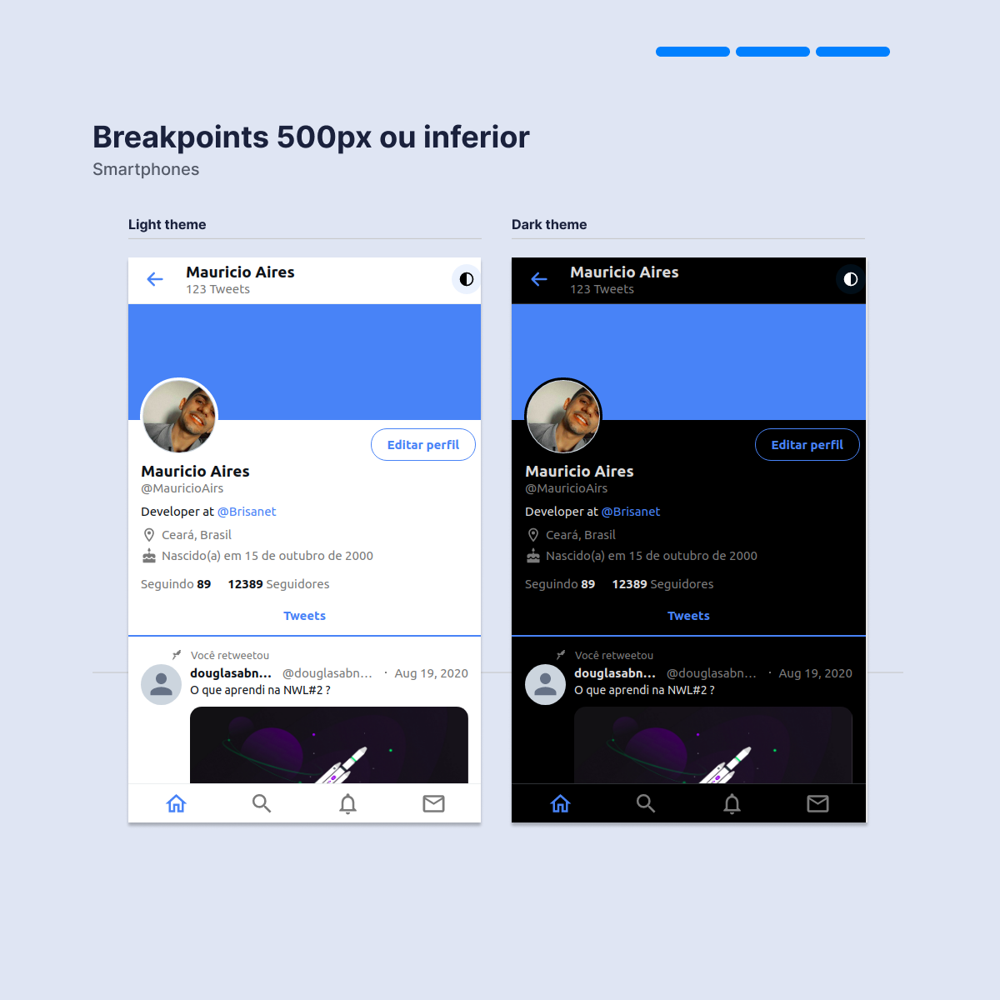

<h1 align="center">
  
</h1>

  <a href="#-tecnologias">Tecnologias</a>&nbsp;&nbsp;&nbsp;|&nbsp;&nbsp;&nbsp;
  <a href="#-projeto">Projeto</a>&nbsp;&nbsp;&nbsp;|&nbsp;&nbsp;&nbsp;
  <a href="#-layout">Layout</a>&nbsp;&nbsp;&nbsp;|&nbsp;&nbsp;&nbsp;
  <a href="#-como-executar">Como executar</a>&nbsp;&nbsp;&nbsp;|&nbsp;&nbsp;&nbsp;
  <a href="#-licença">Licença</a>

  
  
  

  

  

 

## ✨ Tecnologias

Esse projeto foi desenvolvido com as seguintes tecnologias:

- [React](https://reactjs.org)
- [TypeScript](https://www.typescriptlang.org/)

## 💻 Projeto

Então... dando o primeiro passo nos estudos de react resolvi recriar parcialmente a interface do Twitter seguindo a super aula do [Guilherme Rodz](https://github.com/guilhermerodz).

Bastante focando em componentização e responsividade, foi utilizado as propriedades min, max e @media para obter o melhor resultado, aplicando breakpoints nas larguras de 500px, 1000px, 1280px.

Fui um pouco além da aula 🤭 e utilizei o ThemeProvider do próprio styled-components para aplicar os temas light e dark.

Ficou legal, resolvi compartilhar com vocês.

Segue abaixo o link do deploy na Vercel:

Vercel: [https://twitter-airs.vercel.app/](https://twitter-airs.vercel.app/)

## 🔖 Layout

Layout do projeto

## 🚀 Como executar

- Clone o repositório
- Instale as dependências com `yarn`
- Inicie o servidor com `yarn start`

Agora você pode acessar [`localhost:3000`](http://localhost:3000) do seu navegador.

## 📄 Licença

Esse projeto está sob a licença MIT. Veja o arquivo [LICENSE](LICENSE) para mais detalhes.
